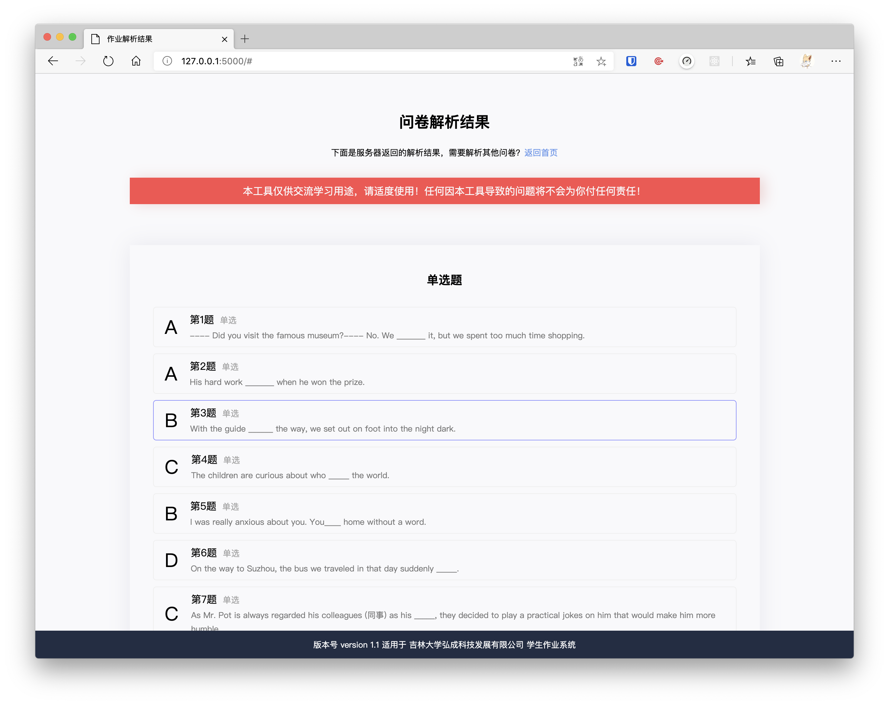

## 吉林大学作业解析工具

**吉林大学在线教育作业解析工具，从 HTTP 包中直接获取试卷/作业答案**

适用范围：吉林大学弘成科技发展有限公司开发的学生作业系统
程序语言：Python3，Flask

## 使用方法

在线使用 https://exam.furrys.cn

- [登录吉林大学网络教育平台](http://dec.jlu.edu.cn/baozi/cmslogin.jsp)
- 进入[作业系统](http://dec.jlu.edu.cn/jludec/work/work/student/index_admin.jsp（未登陆之前点这个链接会报错）
- 在作业管理系统，选择要做的作业，点击开始考试
- 按下 F12 键，打开浏览器调试工具
- 选择"网络"，在筛选器上筛选“XHR”
- 在题目上随便选一个答案，点击“保存”
- 这时可以在网络工具下看到出现一个“SubmitAnserPaper”
- 选中“SubmitAnserPaper”，点“预览”
- 按下键盘 Ctrl+A（苹果电脑 Command+A）全选，复制预览内容
- 粘贴至解析工具，输入执行密钥，点击提交。

环境需求：3.X 或以上的 Python && 1.1.X 以上的 Flask 库版本

## 部署方法

- 请确保系统内安装了 3.X 或以上的 Python 版本，使用`python -v`查看 Python 版本。
- 安装 flask 扩展 `pip install flask`
- 使用命令将代码 clone 至本地：
  `git clone https://github.com/FantWings/jlu_homework_helper.git`
- 使用`cp .token token`复制一份 token 文件，并修改里面的内容为你想要的 token（越长越好）
- 运行程序 `flask run`
  - 默认监听 127.0.0.1，如果需要任意网络访问请使用参数-h 0.0.0.0（非常不建议）
