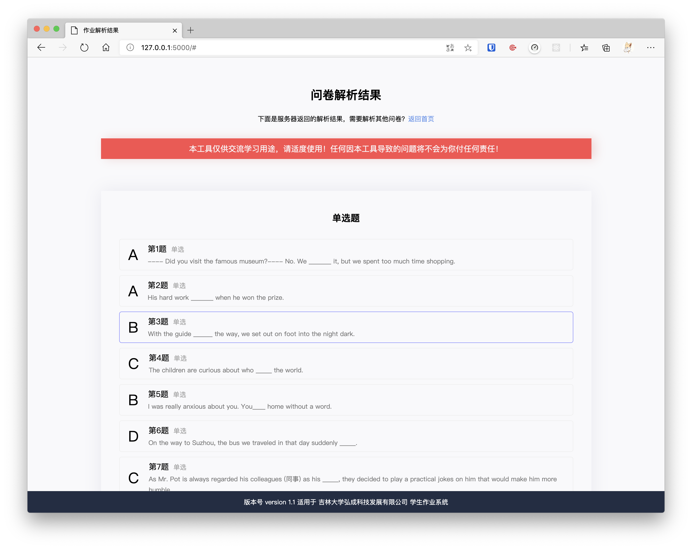

## 吉林大学作业解析工具

**这个公司开发的考试系统居然在考试期间回传答案数据....于是做了这么一个阴间工具，从 HTTP 包中直接获取试卷/作业答案，并且以简洁易懂的方式展现给有需要的同学，仅供学习交流使用。**

适用范围：吉林大学弘成科技发展有限公司开发的学生作业系统

前端程序语言：原生 HTML, 原生 JavaScript
后端程序语言：Python3，Flask

## 使用方法

**在线使用：https://tools.htips.cn/jlu_helper**

### 操作步骤

- [登录吉林大学网络教育平台](http://dec.jlu.edu.cn/baozi/cmslogin.jsp)
- 进入[作业系统](http://dec.jlu.edu.cn/jludec/work/work/student/index_admin.jsp)（未登陆之前点这个链接会报错）
- 在作业管理系统，选择要做的作业，点击开始考试
- 按下 F12 键，打开浏览器调试工具
- 选择"网络（Network）"，在筛选器上筛选“XHR”
- 在题目上随便选一个答案，点击“保存”
- 这时可以在网络工具下看到出现一个“SubmitAnserPaper”
- 选中“SubmitAnserPaper”，点“响应（Response）”
- 按下键盘 Ctrl+A（苹果电脑 Command+A）全选，复制预览内容
- 粘贴至解析工具，输入执行密钥，点击提交。

## 前后分离

** 为了方便维护，后续版本已做前后端分离，前端统一通过 API 与后端交互，你可以：**

- 将前端文件挪移至任意位置。
- 单独下载前端，自己修改成喜欢的样式。
- 单独下载前端，让其和任意位置的后端交互（自己部署或者用公共后端）

## 在自己电脑/服务器上部署

**环境需求：3.X 或以上的 Python && 1.1.X 以上的 Flask 库版本**

- 请确保系统内安装了 3.X 或以上的 Python 版本，使用`python -v`查看 Python 版本。
- 使用命令将代码 clone 至本地：
  `git clone https://github.com/FantWings/jlu_homework_helper.git`
- 安装 flask 扩展 `pip install flask flask_cors`
- 使用`cp .config config`命令复制一份配置文件，并修改里面的 token 字段为你想要的 token（越长越好）
- 运行程序 `flask run`启动后端。
  - 默认监听 127.0.0.1:5000，如果需要任意网络访问请使用参数-h 0.0.0.0（非常不建议）
- 修改项目文件夹 html/js/ajax.js 内的后端地址为你自己的后端地址（例http://127.0.0.1:5000）
- 使用浏览器打开 html 文件夹下的 index.html 即可访问
